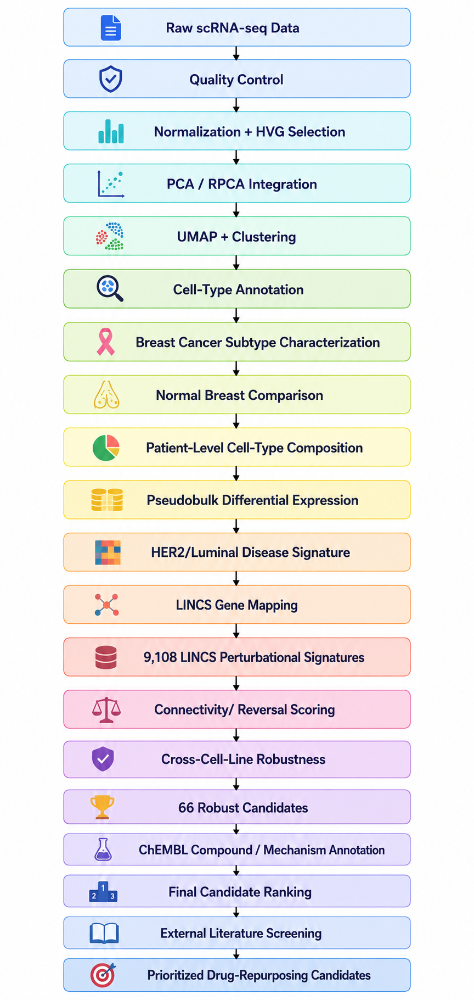

<p align="center">
  
</p>

<h1 align="center">
🧬 HER2-Luminal Breast Cancer Drug Repurposing
</h1>

<p align="center">

Single-cell RNA-seq driven disease characterization and LINCS-based computational drug repurposing

A reproducible computational biology workflow integrating single-cell RNA sequencing, subtype characterization, differential expression, disease-signature construction, LINCS perturbational screening, cross-cell-line validation, ChEMBL mechanism annotation, and external literature validation to prioritize candidate compounds for HER2/luminal breast cancer.

</p>

<p align="center">


</p>

---

# Overview

Breast cancer is a molecularly heterogeneous disease in which distinct transcriptional states and molecular subtypes can exhibit different biological characteristics and therapeutic vulnerabilities.

This project develops an end-to-end computational framework for identifying potential drug-repurposing candidates associated with a HER2/luminal breast cancer transcriptional phenotype.

The workflow begins with single-cell RNA-seq data and progressively narrows the analysis from cellular characterization to a disease-specific transcriptional signature and finally to candidate drug prioritization.

The pipeline integrates:

- Single-cell RNA-seq quality control
- Normalization and highly variable gene analysis
- PCA, RPCA integration, UMAP, and clustering
- Cell-type annotation and validation
- Breast cancer subtype characterization
- Normal breast tissue comparison
- Patient-level cell-type composition analysis
- Pseudobulk differential expression
- HER2/luminal disease-signature construction
- LINCS perturbational signature screening
- Connectivity-based compound prioritization
- Cross-cell-line robustness analysis
- ChEMBL compound and mechanism annotation
- External literature validation
- Final portfolio-oriented candidate ranking

The final analysis prioritized **66 robust candidate compounds**, including **3 Priority A candidates**, after integrating transcriptional reversal, cross-cell-line reproducibility, compound identity, mechanism evidence, and external validation.

> **Important:** This project represents computational drug-repurposing prioritization. The results do not establish clinical efficacy, safety, or therapeutic suitability.

---

# Project Objectives

The project aims to:

- Characterize breast cancer cellular populations using scRNA-seq.
- Identify and validate major epithelial and non-epithelial cell populations.
- Characterize breast cancer molecular subtypes.
- Compare breast cancer transcriptional states with normal breast tissue.
- Quantify patient-level cellular composition.
- Perform cell-type-aware pseudobulk differential expression analysis.
- Construct a disease-specific HER2/luminal transcriptional signature.
- Identify genes associated with the disease state.
- Map disease genes to LINCS perturbational data.
- Screen thousands of compound-induced transcriptional signatures.
- Quantify transcriptional connectivity between disease and drug perturbations.
- Identify compounds capable of reversing the disease-associated transcriptional state.
- Evaluate candidate reproducibility across multiple breast cancer cell lines.
- Annotate candidate compounds using ChEMBL.
- Integrate mechanism-of-action evidence.
- Perform external literature validation of high-ranked candidates.
- Produce a transparent final candidate ranking suitable for downstream investigation.

---

# Project Highlights

- ✅ End-to-End scRNA-seq Analysis
- ✅ Multiple Breast Cancer Cohorts
- ✅ HER2/Luminal Subtype Characterization
- ✅ Normal Breast Tissue Comparison
- ✅ Patient-Level Cell-Type Composition
- ✅ Pseudobulk Differential Expression
- ✅ Disease-Signature Construction
- ✅ LINCS Connectivity Screening
- ✅ 9,108 Perturbational Signatures Screened
- ✅ 6,720 LINCS Compounds Represented
- ✅ Five Breast Cancer Cell Lines
- ✅ Cross-Cell-Line Robustness Analysis
- ✅ 66 Robust Drug-Reversal Candidates
- ✅ ChEMBL Mechanism Annotation
- ✅ External Literature Validation
- ✅ Final Evidence-Based Candidate Prioritization
- ✅ Reproducible R-Based Workflow

---

# Repository Workflow

The complete computational workflow follows a progressive narrowing strategy:

<p align="center">
  
</p>

---

# Single-Cell RNA-seq analysis

The first stage of the project focuses on the characterization of breast cancer single-cell transcriptomic data. The workflow was designed to preserve biological structure while minimizing technical variation b/w samples.

The analysis includes:

- Raw data import
- Seurat object construction
- Quality-control assessment
- Filtering of low-quality cells
- Normalization
- Highly variable gene identification
- Scaling
- PCA
- Principal component diagnostics
- RPCA-based integration
- UMAP dimensionality reduction
- Graph-based clustering
- Cluster marker identification
- Cell-type annotation
- Annotation validation

---

# Breast Cancer Subtype Characterization

Following cellular annotation, epithelial populations were characterized to identify breast cancer molecular subtypes.

The analysis evaluates transcriptional patterns associated with:

- HER2-positive disease
- ER-positive/luminal disease
- Triple-negative breast cancer
- Other epithelial states

HER2/luminal characterization was subsequently used as the biological context for the downstream drug-repurposing analysis.

---

# Normal Breast Tissue Comparison

A separate normal breast single-cell dataset was processed using a compatible analytical framework.

The normal cohort was used to provide a non-malignant reference for:

- Cellular composition
- Cell-type annotation
- Marker expression
- UMAp/clustering structure
- Differential expression
- Disease-state comparison

This comparison provides additional biological context for identifying disease-associated transcriptional changes.

---

# Patient-Level Cell-Type Composition

Cell-type composition was evaluated at the patient level rather than relying exclusively on pooled cell counts.

This analysis helps distinguish:

- Differences in cellular abundance
- Patient-to-patient variability
- Subtype-associated composition changes
- Potential biological heterogeneity between samples

Patient-level summaries were retained as downstream results for visualization and interpretation.

---

# Pseudobulk Differential Expression

Cell-type-aware pseudobulk differential expression was performed to identify transcriptional differences between breast cancer groups and normal tissue.

Comparisons included:

- HER2-positive vs normal
- ER-positive vs normal
- TNBC vs normal
- HER2-positive vs ER-positive
- TNBC vs HER2-positive
- TNBC vs ER-positive

Pseudobulk analysis aggregates single-cell expression within biologically meaningful sample/cell-type units, providing a more appropriate framework for patient-level differential expression than treating individual cells as independent biological replicates.

---

# Disease Signature Contruction

The HER2/luminal disease state was used to construct a disease-associated transcriptional signature.

The finalized extended disease signature contained:

### 454 genes

The signature was divided into:

- Disease-upregulated genes
- Disease-downregulated genes

A smaller high-confidence core signature was also retained for biological interpretation.

## Core Signature

The final core signature contained:

### 10 genes

The core genes included:

```text
DIO1
AC005013.5
SRPK3
NR4A1
ATP6V0A4
EGR4
TTC6
TCN1
LAMB3
FKBP1B
```

The contextual HER2/luminal markers included:

```text
ERBB2
GRB7
FOXA1
AR
```

These genes provide biological context for the transcriptional state used in the downstream connectivity analysis.
