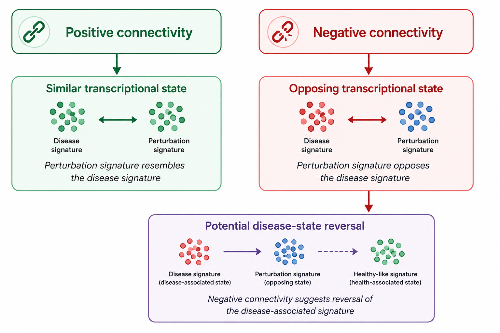

<p align="center">
  
</p>

<h1 align="center">
🧬 HER2-Luminal Breast Cancer Drug Repurposing
</h1>

<p align="center">

Single-cell transcriptomics-driven disease signature construction and LINCS-based computational drug repurposing

A reproducible computational biology workflow integrating single-cell RNA sequencing, subtype characterization, differential expression, disease-signature construction, LINCS perturbational screening, cross-cell-line validation, ChEMBL mechanism annotation, and external literature validation to prioritize computational drug-repurposing candidates for the HER2/luminal breast cancer transcriptional state.

</p>

<p align="center">


</p>

---

# Overview

Breast cancer is a molecularly heterogeneous disease in which distinct transcriptional states and molecular subtypes can exhibit different biological characteristics and therapeutic vulnerabilities.

This project develops an end-to-end computational framework to identify potential drug-repurposing candidates associated with the HER2/luminal breast cancer transcriptional phenotype.

The workflow begins with single-cell RNA-seq data and progressively narrows the analysis from cellular characterization to a disease-specific transcriptional signature and finally to candidate drug prioritization.

The pipeline integrates:

- Single-cell RNA-seq quality control
- Normalization and highly variable gene analysis
- PCA, RPCA integration, UMAP, and clustering
- Cell-type annotation and validation
- Breast cancer subtype characterization
- Normal breast tissue comparison
- Patient-level cell-type composition analysis
- Pseudobulk differential expression
- HER2/luminal disease-signature construction
- LINCS perturbational signature screening
- Connectivity-based compound prioritization
- Cross-cell-line robustness analysis
- ChEMBL compound and mechanism annotation
- External literature validation
- Final portfolio-oriented candidate ranking

The final analysis prioritized **66 robust computational drug-repurposing candidates**, including **3 Priority A candidates**, after integrating transcriptional reversal, cross-cell-line reproducibility, compound identity, mechanism evidence, and external validation.

> **Important:** This project represents computational drug-repurposing prioritization. The results do not establish clinical efficacy, safety, or therapeutic suitability.

---

# Project Objectives

The project aims to:

- Characterize breast cancer cellular populations using scRNA-seq.
- Identify and validate major epithelial and non-epithelial cell populations.
- Characterize breast cancer molecular subtypes.
- Compare breast cancer transcriptional states with normal breast tissue.
- Quantify patient-level cellular composition.
- Perform cell-type-aware pseudobulk differential expression analysis.
- Construct a disease-specific HER2/luminal transcriptional signature.
- Identify genes associated with the disease state.
- Map disease genes to LINCS perturbational data.
- Screen thousands of compound-induced transcriptional signatures.
- Quantify transcriptional connectivity between disease and drug perturbations.
- Identify compounds whose perturbational signatures oppose the disease-associated transcriptional state.
- Negative connectivity was interpreted as potential transcriptional reversal rather than demonstrated therapeutic efficacy.
- Evaluate candidate reproducibility across multiple breast cancer cell lines.
- Annotate candidate compounds using ChEMBL.
- Integrate mechanism-of-action evidence.
- Perform external literature validation of high-ranked candidates.
- Produce a transparent final candidate ranking suitable for downstream investigation.

---

# Project Highlights

- ✅ End-to-End scRNA-seq Analysis
- ✅ Multiple Breast Cancer Cohorts
- ✅ HER2/Luminal Subtype Characterization
- ✅ Normal Breast Tissue Comparison
- ✅ Patient-Level Cell-Type Composition
- ✅ Pseudobulk Differential Expression
- ✅ Disease-Signature Construction
- ✅ LINCS Connectivity Screening
- ✅ 9,108 Perturbational Signatures Screened
- ✅ 6,720 LINCS Compounds Represented
- ✅ Five Breast Cancer Cell Lines
- ✅ Cross-Cell-Line Robustness Analysis
- ✅ 66 Robust Drug-Reversal Candidates
- ✅ ChEMBL Mechanism Annotation
- ✅ External Literature Validation
- ✅ Final Evidence-Based Candidate Prioritization
- ✅ Reproducible R-Based Workflow

---

# Repository Workflow

The complete computational workflow follows a progressive narrowing strategy:

<p align="center">
  
</p>

---

# Single-Cell RNA-seq analysis

The first stage of the project focuses on the characterization of breast cancer single-cell transcriptomic data. The workflow was designed to preserve biological structure while minimizing technical variation between samples.

The analysis includes:

- Raw data import
- Seurat object construction
- Quality-control assessment
- Filtering of low-quality cells
- Normalization
- Highly variable gene identification
- Scaling
- PCA
- Principal component diagnostics
- RPCA-based integration
- UMAP dimensionality reduction
- Graph-based clustering
- Cluster marker identification
- Cell-type annotation
- Annotation validation

---

# Breast Cancer Subtype Characterization

Following cellular annotation, epithelial populations were characterized to identify breast cancer molecular subtypes.

The analysis evaluates transcriptional patterns associated with:

- HER2-positive disease
- ER-positive/luminal disease
- Triple-negative breast cancer
- Other epithelial states

HER2/luminal characterization was subsequently used as the biological context for the downstream drug-repurposing analysis.

---

# Normal Breast Tissue Comparison

A separate normal breast single-cell dataset was processed using a compatible analytical framework.

The normal cohort was used to provide a non-malignant reference for:

- Cellular composition
- Cell-type annotation
- Marker expression
- UMAp/clustering structure
- Differential expression
- Disease-state comparison

This comparison provides additional biological context for identifying disease-associated transcriptional changes.

---

# Patient-Level Cell-Type Composition

Cell-type composition was evaluated at the patient level rather than relying exclusively on pooled cell counts.

This analysis helps distinguish:

- Differences in cellular abundance
- Patient-to-patient variability
- Subtype-associated composition changes
- Potential biological heterogeneity between samples

Patient-level summaries were retained as downstream results for visualization and interpretation.

---

# Pseudobulk Differential Expression

Cell-type-aware pseudobulk differential expression was performed to identify transcriptional differences between breast cancer groups and normal tissue.

Comparisons included:

- HER2-positive vs normal
- ER-positive vs normal
- TNBC vs normal
- HER2-positive vs ER-positive
- TNBC vs HER2-positive
- TNBC vs ER-positive

Pseudobulk analysis aggregates single-cell expression within biologically meaningful sample/cell-type units, providing a more appropriate framework for patient-level differential expression than treating individual cells as independent biological replicates.

---

# Disease Signature Construction

The HER2/luminal disease state was used to construct a disease-associated transcriptional signature.

The finalized extended disease signature contained:

### 454 genes

The signature was divided into:

- Disease-upregulated genes
- Disease-downregulated genes

A smaller high-confidence core signature was also retained for biological interpretation.

## Core Signature

The final core signature contained:

### 10 genes

The core genes included:

```text
DIO1
AC005013.5
SRPK3
NR4A1
ATP6V0A4
EGR4
TTC6
TCN1
LAMB3
FKBP1B
```

The contextual HER2/luminal markers included:

```text
ERBB2
GRB7
FOXA1
AR
```

These genes provide biological context for the transcriptional state used in the downstream connectivity analysis.

---

# LINCS Perturbational Screening

The disease signature was mapped to LINCS perturbational expression data to identify compounds that induce transcriptional states opposing the disease-associated transcriptional program.

The analysis used:

- **315 disease genes** successfully mapped to LINCS
- **9,108 perturbational signatures**
- **6,720 unique compounds**
- **5 breast cancer cell lines**

The five cell lines represented in the analysis were:

```text
BT20
HS578T
MCF7
MDAMB231
SKBR3
```

These LINCS signatures represented compound perturbations under the selected screening conditions.

---

# Connectivity Scoring

For each LINCS signature, a connectivity score was calculated to quantify the relationship between the disease transcriptional signature and the compound-induced transcriptional response.

Conceptually:
<p align="center">
  
</p>

Compounds producing reproducible positive reversal scores across relevant cell lines were prioritized for downstream analysis.

---

# Cross-Cell-Line Robustness

A major component of the prioritization strategy was cross-cell-line reproducibility.

Among the LINCS compounds:

**167 compounds** had perturbational signatures represented across all five breast cancer cell lines.

These compounds were evaluated based on:

- Number of positive cell lines
- Number of negative cell lines
- Median connectivity score
- Mean connectivity score
- Minimum connectivity score
- Reproducibility
- Positive connectivity fraction

**66 robust drug-repurposing candidates**

Candidates were divided into three tiers:

| Tier | Interpretation |
|-----------|------------|
| Tier 1 | Consistent reversal across 5/5 cell lines |
| Tier 2 | Strong reversal across >= 4/5 cell lines |
| Tier 3 | Moderate reversal across >= 3/5 cell lines | 

The final robust candidate set was then carried forward for compound annotation and evidence integration.

---

# ChEMBL Compound Annotation

The 66 robust candidates were mapped to ChEMBL to obtain additional chemical and pharmacological information.

The annotation workflow included:

- Compound identity matching
- ChEMBL identifier assignment
- Preferred compound name
- Clinical development phase where available
- Mechanism-of-action records
- Target identifiers
- Action types

The ChEMBL validation identified:

- **66 candidate compounds**
- **64 unique ChEMBL identifiers**
- **30 high-confidence compound identities**
- **36 identities requiring review**
- **23 candidates with mechanism evidence**
- **43 candidates without mechanism records**

ChEMBL annotation was used as supporting evidence rather than as proof of therapeutic activity.

---

# Mechanism Interpretation

Mechanism-supported candidates were grouped into broad mechanism categories.

The mechanism-supported candidate set contained:

| Mechanism Category | Candidates |
|-----------|------------|
| Kinase | 11 |
| Angiogenesis | 2 |
| Cytoskeleton | 1 | 
| DNA Damage Response | 1 |
| Other/Unclassified | 8 |

The dominance of kinase-associated candidates provides a biologically interpretable pattern within the computationally prioritized compound set.

However, mechanism annotation does not establish that a compound will therapeutically reverse the disease phenotype in patients.

---

# External Literature Validation

The top 20 computationally ranked candidates were subjected to an external literature screening step.

The screening evaluated evidence related to:

- Breast cancer
- HER2-associated research
- Oncology
- Published evidence for the candidate compound

Results:

- **20 candidates evaluated**
- **20 literature queries completed**
- **19 candidates with breast cancer/HER2-related evidence**
- **1 candidate with limited external evidence**

External evidence was incorporated into the final portfolio-oriented interpretation.

---

# Final Results

The complete computational pipeline produced the following key results:

| Metric | Result |
|-----------|------------|
| Disease signature genes | 454 |
| Core signature genes | 10 |
| LINCS genes mapped | 315 | 
| LINCS signatures screened | 9,108 |
| LINCS compounds represented | 6,720 |
| Breast cancer cell lines | 5 |
| Compounds tested in all 5 cell lines | 167 |
| Robust LINCS candidates | 66 |
| Mechanism-supported candidates | 23 | 
| Priority A candidates | 3 |
| Priority B candidates | 8 |
| Priority C candidates | 29 |
| Exploratory candidates | 26 |
| Candidates externally screened | 20 |

---

# Top Portfolio Candidates

The final ranking identified the following candidates among the highest-priority computational results:

| Rank | Candidate | Priority | Evidence Level | 
|-----------|------------|-----------|------------|
| 1 | BMS-777607 | Priority A | High |
| 2 | Motesanib | Priority A | High |
| 3 | GSK-3-inhibitor-IX | Priority C | Secondary |
| 4 | Pazopanib | Priority B | Moderate |
| 5 | GW-5074 | Priority C | Secondary |
| 6 | OSI-930 | Priority A | High |
| 7 | PHA-665752 | Priority B | Moderate |
| 8 | PLX-4720 | Priority B | Moderate |
| 9 | GW-843682X | Priority C | Secondary |
| 10 | Sorafenib | Priority B | Moderate |

## Priority A Candidates

The final Priority A group includes:
1. BMS-777607
2. Motesanib
3. OSI-930

These compounds combined strong computational reversal characteristics with supporting annotation/evidence within the project's ranking framework.

**Important:** Priority A represents the highest computational priority within this project. It does not mean that these compounds are clinically recommended treatments.

---

# Connectivity Characteristics of Priority A candidates

| Candidate | Positive Cell Lines | Median Connectivity |
|-----------|------------|-----------|
| BMS-777607 | 4/5 | 0.314 |
| Motesanib | 4/5 | 0.304 |
| OSI-930 | 3/5 | 0.364 |

These candidates were prioritized through the integration of transcriptional reversal, reproducibility, compound annotation, and mechanism/evidence information.

---

# Results & Visualization

The repository contains selected analytical outputs and figures generated throughout the workflow.

## PCA

PCA results provide an overview of major sources of transcriptional variation before and after integration.

Relevant outputs are available under:

```text
results/pca/
```
---
## UMAP & Clustering

UMAP visualizations show the major cellular populations identified in the single-cell datasets.

Relevant outputs are available under:

```text
results/umap/
```
---
## Subtype Characterization

Subtype-associated results and visualizations are available under:

```text
results/subtype_characterization/
```
---

## Patient-Level Composition

Patient-level cellular composition analyses are available under:

```text
results/patient_level_composition/
```
---
## Pathway Analysis

Pathway-level interpretation of disease-associated transcriptional programs is available under:

```text
results/pathway_analysis/
```
---
## Disease Signature

Disease-signature validation and finalized signature outputs are available under:

```text
results/disease_signature/
```
---
## LINCS Drug Repurposing

LINCS connectivity and candidate prioritization outputs are available under:

```text
results/drug_repurposing/
```
Important outputs include:

```text
HER2_Luminal_FINAL_CANDIDATE_RANKING_QC.csv
HER2_Luminal_PRIORITY_A_CANDIDATES_QC.csv
HER2_Luminal_HIGH_CONFIDENCE_IDENTITIES.csv
HER2_Luminal_MECHANISM_SUPPORTED_CANDIDATES.csv
HER2_Luminal_STRONG_LINCS_NO_MECHANISM_QC.csv
HER2_Luminal_TOP30_FINAL_CANDIDATES.csv
```

---

# Technology Stack

| Category | Technology | Purpose |
|-----------|------------|-----------|
| Programming | R | Computational analysis|
| scRNA-seq | Seurat | Single-cell processing and analysis |
| Data manipulation | dplyr | Data processing |
| Visualization | ggplot2 | Scientific visualization |
| Statistics | R statistical ecosystem | Differential expression and QC |
| Integration | RPCA | Dataset integration |
| Perturbational screening | LINCS | Drug-induced transcriptional signatures |
| Compound annotation | ChEMBL | Compound and mechanism annotation |
| Literature validation | External literature | Candidate evidence assessment |
| Version control | Git/GitHub | Reproducible project management |

---

# Installation

## 1. Clone the repository

```bash
git clone https://github.com/AbhimanyuMandal/HER2-Luminal-Breast-Cancer-Drug-Repurposing.git
cd HER2-Luminal-Breast-Cancer-Drug-Repurposing
```

## 2. Install R

The project was developed using R and commonly used Bioconductor/CRAN packages.

Install R from:

```text
https://cran.r-project.org/
```

## 3. Install Required Packages

The major R packages used include:
```R
install.packages(c(
  "Seurat",
  "dplyr",
  "ggplot2",
  "readr",
  "tidyr",
  "stringr",
  "httr2"
))
```

Additional packages may be required depending on the specific analysis stage.

---

# Running the Pipeline

The pipeline is organized into sequential R scripts.

Scripts are numbered according to the analytical workflow.

```text
01–12   Breast cancer scRNA-seq processing
13–23   Normal breast cohort processing
24–25   Cohort harmonization and composition
26      Pseudobulk differential expression
27–29   Disease-signature construction and validation
30–31   LINCS extraction and connectivity analysis
32      ChEMBL compound/mechanism annotation
33      Final candidate ranking
34      Biological interpretation
35      External candidate validation
36      Final portfolio summary
```

To run an individual stage:

```bash
Rscript scripts/01_create_GSE176078_object.R
```

For example, the final portfolio summary can be generated using:

```bash
Rscript scripts/36_final_portfolio_summary.R
```

The scripts expect the repository's directory structure to remain unchanged.

---

# Repository Structure

```text
HER2-Luminal-Breast-Cancer-Drug-Repurposing/
│
├── README.md
├── LICENSE
├── .gitignore
│
├── assets/
│   ├── drug_repurposing_banner.png
│   ├── connectivity_scoring.png
│   └── her2_workflow.png
│
├── data/
│   ├── raw/
│   └── processed/
│
├── scripts/
│   ├── 01_create_GSE176078_object.R
│   ├── 02_qc_GSE176078.R
│   ├── 03_apply_QC.R
│   ├── 04_normalization_HVG_PCA.R
│   ├── 05_inspect_PCA.R
│   ├── 06_PCA_patient_subtype_diagnostics.R
│   ├── 07_seurat_RPCA_integration.R
│   ├── 08_umap_clustering.R
│   ├── 09_cluster_markers_annotation.R
│   ├── 10_validate_annotations.R
│   ├── 11_final_annotation.R
│   ├── 12_subtype_characterization.R
│   │
│   ├── 13_extract_GSE113196.R
│   ├── 14_create_GSE113196_seurat.R
│   ├── 15_GSE113196_QC_filtering.R
│   ├── 16_GSE113196_normalization_PCA.R
│   ├── 17_umap_clustering_normal.R
│   ├── 18_rpca_integration_normal.R
│   ├── 19_normal_breat_integrated_clustering.R
│   ├── 20_normal_breast_markers.R
│   ├── 21_normal_breast_marker_plots.R
│   ├── 22_normal_breast_annotation.R
│   ├── 23_normal_breast_annotation_validation.R
│   │
│   ├── 24_cohort_celltype_harmonization.R
│   ├── 25_patient_level_celltype_composition.R
│   ├── 26_pseudobulk_disease_subtype_DE.R
│   │
│   ├── 27_HER2_luminal_disease_signature_qc.R
│   ├── 28_pathway_signature_analysis.R
│   ├── 29_validate_finalize_disease_signature.R
│   │
│   ├── 30_lincs_gctx_extraction.R
│   ├── 30B_lincs_extraction_qc.R
│   ├── 31_lincs_connectivity_scoring.R
│   ├── 31B_lincs_connectivity_QC.R
│   ├── 31C_lincs_robust_compound_prioritization.R
│   │
│   ├── 32_candidate_mechanism_target_annotation.R
│   ├── 32B_ChEMBL_annotation_QC.R
│   ├── 32C_chembl_evidence_validation.R
│   │
│   ├── 33_final_candidate_validation_ranking.R
│   ├── 33B_final_ranking_qc.R
│   ├── 34_candidate_biological_interpretation.R
│   ├── 35_external_candidate_validation.R
│   └── 36_final_portfolio_summary.R
│
├── results/
│   ├── annotation/
│   ├── cohort_harmonization/
│   ├── disease_signature/
│   ├── drug_repurposing/
│       ├── ChEMBL mechanism annotation/
│       ├── biological interpretation/
│       ├── external validation/
│       └── final_portfolio/
│   ├── final_disease_signature/
│   ├── her2_vs_normal/
│   ├── markers/
│   ├── pathway_analysis/
│   ├── patient_level_composition/
│   ├── pca/
│   ├── pseudobulk_DE/
│   ├── qc/
│   ├── subtype_characterization/
│   ├── umap/
│
└── docs/
```

Large raw and intermediate datasets are intentionally not included in the GitHub repository when their size exceeds practical version-control limits.

---

# Pipeline Components

## 1. Single-Cell Quality Control

### Objective

Ensure that low-quality cells and technical artifacts are removed before downstream analysis.

### Major steps

- Cell-level QC
- Gene detection assessment
- Filtering
- QC visualization
- Dataset diagnostics

### Output

Quality-controlled single-cell dataset.

## 2. Normalization & Feature selection

### Objective

Prepare the single-cell expression matrix for dimensionality reduction and clustering.

### Major steps

- Normalization
- Highly Variable Genes (HVGs) identification
- Scaling
- PCA
- Principal component diagnostics

### Output

Normalized expression representation suitable for downstream integration.

## 3. Dataset Integration

### Objective

Reduce technical variation between samples while retaining biological variation.

### Major approach

**Reciprocal PCA (RPCA)** integration using Seurat.

### Output

Integrated single-cell representation.

## 4. UMAP and Clustering

### Objective

Identify transcriptionally distinct cellular populations.

### Major steps

- Nearest-neighbor graph construction
- Clustering
- UMAP
- Cluster visualization

### Output

Clustered and dimensionally reduced single-cell dataset.

## 5. Cell-Type Annotation

### Objective

Assign biological identities to transcriptionally defined clusters.

### Major steps

- Cluster marker identification
- Canonical marker evaluation
- Annotation
- Independent validation
- Final annotation

### Output

Annotated breast cancer single-cell dataset.

## 6. Subtype Characterization

### Objective

Characterize molecular subtype-associated epithelial populations.

The analysis focuses on transcriptional features associated with:

- HER2-positive breast cancer
- ER-positive/luminal breast cancer
- TNBC

The resulting subtype characterization provides the biological context for disease-signature construction.

## 7. Normal Breast Comparison

### Objective

Establish a normal-tissue reference for interpreting disease-associated transcriptional changes.

A separate normal breast scRNA-seq cohort was processed and annotated using a compatible workflow.

## 8. Pseudobulk Differential Expression

### Objective

Identify patient-level transcriptional differences between disease subtypes and normal tissue.

The analysis was performed separately within relevant cell-type populations.

### Output

Differential expression tables and volcano plots.

## 9. Disease-Signature Construction

### Objective

Create a robust transcriptional representation of the HER2/luminal disease state.

### Key results

```text
454 extended disease-signature genes
10 core signature genes
214 disease-upregulated genes
240 disease-downregulated genes
```
This signature became the input for LINCS connectivity screening.

## 10. LINCS Connectivity Analysis

### Objective

Identify compound-induced transcriptional profiles that oppose the disease-associated expression program.

### Key results

```text
315 mapped disease genes
9,108 LINCS signatures
6,720 unique compounds
5 breast cancer cell lines
```

## 11. Robust Compound Prioritization

### Objective

Identify candidates whose reversal signal is reproducible across breast cancer cell lines.

### Key results

```text
167 compounds represented in all 5 cell lines
66 robust reversal candidates
```
Candidates were ranked according to connectivity strength and reproducibility.

## 12. Mechanism Annotation

### Objective

Provide pharmacological context for computationally prioritized compounds.

ChEMBL was used to retrieve:

- Compound identifiers
- Preferred names
- Mechanism-of-action records
- Target identifiers
- Action types
- Development-phase information where available

## 13. Final Candidate Ranking

### Objective

Integrate computational and supporting evidence into a final candidate prioritization framework.

The ranking incorporates:

- Connectivity strength
- Reproducibility
- Positive-cell-line fraction
- Compound identity confidence
- Mechanism evidence
- External evidence

### Final classification

```text
Priority A: 3 candidates
Priority B: 8 candidates
Priority C: 29 candidates
Exploratory: 26 candidates
```

## 14. External Validation

### Objective

Assess whether high-ranked computational candidates have supporting evidence in external literature.

The top 20 candidates were screened for:

- Breast cancer evidence
- HER2-related evidence
- General oncology evidence

This step provides contextual evidence for interpreting computational predictions.

---

# Key Biological Findings

The disease signature showed strong transcriptional differences involving genes associated with multiple biological processes.

The pathway analysis highlighted altered programs involving:

- Apoptotic processes
- Wound response
- Wound healing
- Chemotaxis
- Epidermis development
- Intrinsic apoptotic signaling
- Leukocyte migration
- Cell adhesion
- Lymphocyte activation

The HER2/luminal context was supported by elevated expression of:

```text
ERBB2
GRB7
FOXA1
AR
```

These findings provided the biological context for downstream perturbational screening.

---

# Limitations

This project is a computational drug-repurposing prioritization framework and has several important limitations.

## 1. Computational evidence is not therapeutic evidence

A strong LINCS connectivity score does not demonstrate clinical efficacy.

## 2. LINCS signatures are context-dependent

Drug-induced transcriptional responses can vary with:

- Cell line
- Dose
- Exposure time
- Experimental conditions

## 3. Compound identity matching can be imperfect

Some LINCS perturbations required identity review during ChEMBL annotation.

## 4. Mechanism databases are incomplete

Absence of a ChEMBL mechanism record does not mean that a compound has no biological mechanism.

## 5. External literature validation is not experimental validation

Literature evidence provides supporting context but does not establish activity in the specific disease context analyzed here.

## 6. Experimental validation is required

The final candidates should be considered hypotheses for downstream experimental testing rather than therapeutic recommendations.

---

# Reproducibility

The workflow was designed around reproducible computational analysis principles.

Features include:

- Numbered analysis scripts
- Modular pipeline stages
- Explicit input/output directories
- Saved intermediate analytical results
- QC checkpoints
- Separate validation stages
- Version-controlled source code
- Structured result directories
- Final ranking and evidence tables

Each major stage can be inspected independently through the corresponding numbered script.

---

# Data Sources

The project integrates publicly available biological resources including:

## Single-cell RNA-seq
GEO datasets used:
- GSE176078 - breast cancer scRNA-seq cohort
- GSE113196 - normal breast tissue scRNA-seq cohort

## LINCS

- The Library of Integrated Network-Based Cellular Signatures was used for perturbational transcriptional profiling and connectivity analysis.

## ChEMBL

- ChEMBL was used for compound identity and mechanism-of-action annotation.

## External Literature

- Literature screening was used to provide supporting evidence for high-ranked candidates.

Please consult the original dataset and database documentation for appropriate attribution and citation.

---

# References

Key resources used in the project include:

- Seurat: single-cell RNA-seq analysis
- GEO: Gene Expression Omnibus
- LINCS: Library of Integrated Network-Based Cellular Signatures
- ChEMBL: bioactive molecule and drug information
- R: statistical computing and visualization

Dataset-specific and software-specific citations should be added when the corresponding resources are used in formal scientific work.

---

# Acknowledgements

This project builds upon publicly available datasets, computational resources, and open-source scientific software.

Special thanks to:

- GEO contributors
- LINCS / Connectivity Map community
- ChEMBL / EMBL-EBI
- Seurat development team
- R and Bioconductor communities
- Open-source computational biology community

---

# License

This project is licensed under the **MIT License**.

See the [LICENSE](LICENSE) file for details.

---

# Connect With Me

**Abhimanyu Mandal**

- LinkedIn: https://www.linkedin.com/in/abhimanyu-mandal/
- Portfolio: https://abhimanyumandal.github.io/Personal-Portfolio/
- Email: abhimanyumandal0810@gmail.com

---

<div align="center">

### ⭐ If you found this repository useful, please consider giving it a Star!

</div>
